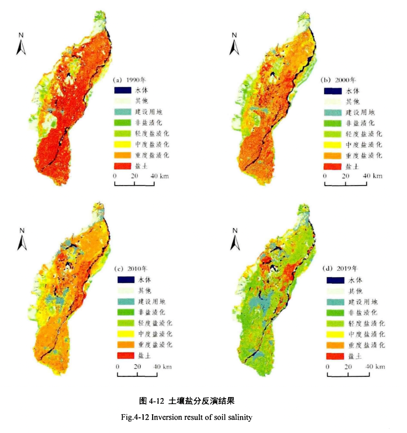
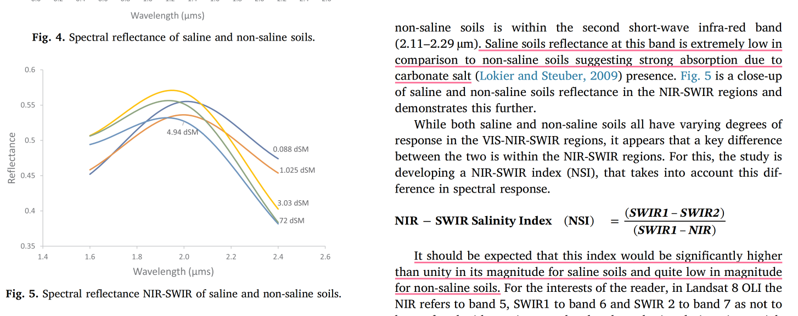

政策需要什么：改盐碱地为农田、利用盐碱地。配套的是一系列的土壤治理、灌溉排水等工程。需要结合第三次全国土壤普查，摸清盐碱地土壤资源、水资源以及水利工程配套情况

遥感能做什么：

* 监测现有的盐碱地分布、盐碱化程度。为改盐碱地为田提供决策前瞻信息。
* 评估“改盐碱”工作进度和成果。通过对比“改盐碱”工作开展前后的盐碱地分布和盐碱化程度来评估工作进展和成果。
* 监控已“改盐碱”的农田。及时发现“反盐”农田。

重点盐碱地区域：

* 黄河三角洲。黄河三角洲地区的土地不仅含盐量高，而且还存在板结、瘠薄的问题
* 宁夏引黄灌区盐碱地综合治理技术模式。河套地区盐渍化土地超过67万公顷
* 山东潍坊市盐碱地改良利用技术模式。累积改良盐碱地超过26万亩
* 山东东营市盐碱地综合利用模式、东营是黄河三角洲中心城市，全市盐碱地面积341万亩，约占山东省盐碱地面积的38％。
* 内蒙古鄂尔多斯市中度盐碱化耕地改良技术模式

*** 
相关工作：

第三次全国土壤普查将在2025年完成，**成果中会包括耕地酸化、盐碱化等退化土壤分布图**

三调和三普的差异：

* 三是内容不同。土壤三普是对土壤理化和生物性状、土壤类型、土壤立地条件、土壤利用情况等的普查。国土三调是对土地利用现状及变化情况、土地权属及变化情况等的调查。
* 四是方法不同。土壤三普是调查采集表层土壤样品，挖掘土壤剖面、采集分层土样，分析化验土壤理化性状等，是三维立体式调查。国土三调是在第二次全国土地调查利用类型图基础上，通过遥感影像对土地利用现状进行判读，实地调查核实变化土地的地类、面积和权属，是二维平面式调查

三普主要还是以实地采样为主，遥感数据只是作为前期参考。而三调是利用遥感数据来初步确定土地利用类型。

## 数据集
* [全球250米分辨率土壤盐度数据集（1986-2016年）](https://www.geodata.cn/data/datadetails.html?dataguid=186416065572720&docId=219)
	* [链接2](https://data.isric.org/geonetwork/srv/api/records/c59d0162-a258-4210-af80-777d7929c512)
	* [链接](https://gee-community-catalog.org/projects/global_salinity/)

* [黄河三角洲不同水盐梯度下土壤调查数据（2014-2015）](https://www.geodata.cn/data/datadetails.html?dataguid=48510269871316&docId=13938)
* [黄土高原植被恢复过程中土壤水分时空变化数据集（1992-2019年）](https://www.geodata.cn/data/datadetails.html?dataguid=140188476023862&docId=272)
* [ Harmonized World Soil Database 归一化世界土壤](https://www.fao.org/soils-portal/data-hub/soil-maps-and-databases/harmonized-world-soil-database-v12/en/)
	* 比较老牌的全球范围内的土壤盐度数据集
	*  但是精度差，比较粗糙
* [世界土壤信息服务数据集WoSIS database]()
	* 	 WoSIS Soil Profile Database 有超过100,000个土壤样本点数据
* [全球土壤属性数据SoilGrids](https://soilgrids.org/) 
	* SoilGrids is a collection of global soil class and soil
properties maps
	* 包括ph、含水量等一些物理和化学性质
* [An Open Compendium of Soil Datasets: Soil Observations and Measurements](https://zenodo.org/records/4748500)
	* [链接2](https://github.com/OpenGeoHub/SoilSamples)

***
## 相关文献

毛鸿欣等[2019]基于特征光谱指数，将高光谱数据和sentinel-2B多光谱数据进行高-多光谱数据融合，以精度较高的高光谱反演模型修正多光谱模型，利用光谱匹配后的反演模型基于各时期的Landsat影像预测了不同时期银川平原上的盐渍化分布格局。研究表明：1990-2019 年非盐渍化和盐土变化程度最大，非、轻、中度盐渍化土壤面积显著增加，其中非盐渍化面积增加量达 1343.57km2，变化率达 27.5%。重度盐渍化土壤和盐土显著降低，其中盐土变化率高达 42.12%，研究时段内面积净减少 2224.35km2.

Abuelgasim等[2019]提出了NSI指数（NIR-SWIR Salinity Index ）以反演和绘制干旱区/半干旱区沙漠的盐渍地的分布情况。NSI利用了高盐渍（高电导率）土壤在SWIR1 的高反射率和在SWIR2、NIR的低反射率特征来区分无盐土壤、低盐土壤和高盐土壤。

 该研究基于Landsat8 OLI的NIR-SWIR 数据和实地样本点数据，利用半经验模型（指数模型）反演阿联酋中西部沙漠地区的盐土分布。并和其他几个盐指数的反演效果进行了对比。
 

##  idea
  
 * 中国半干旱区/干旱区 盐渍化土地几十年来的分布和变化趋势
 	* 	长时序变化趋势[Assessing Climate Change Impact on Soil Salinity Dynamics between 1987–2017 in Arid Landscape Using Landsat TM, ETM+ and OLI Data](https://www.mdpi.com/2072-4292/12/17/2794)这篇文章做过。base 科威特。该文章还评估了环境影响因子
 	*  长时序一般会用上landsat数据

* 耐盐植被区土壤盐度评估
	* 耐盐植被区的植被的光谱特征（主要是热红外）和正常植被的差别不大，用热红外方法在耐盐植被区的分类效果不好。
* 评估多种盐度指数/分类模型 的效果？
* 做一个全球的评估。[Global mapping of soil salinity change](https://www.sciencedirect.com/science/article/pii/S0034425719302792)使用热红外数据和土壤数据，基于随机森林分类方法生成全球盐地趋势图。但存在精度低、样本分布不均匀、局部区域精度不准确等特点。现在有比较均匀的样本数据，能否在此基础上提高精度？精度
* 评估热点地区盐渍化变化趋势，并分析该趋势的驱动因素是气候因素（降水、温度等气候变量）还是人为？（人为因素怎么评估？）